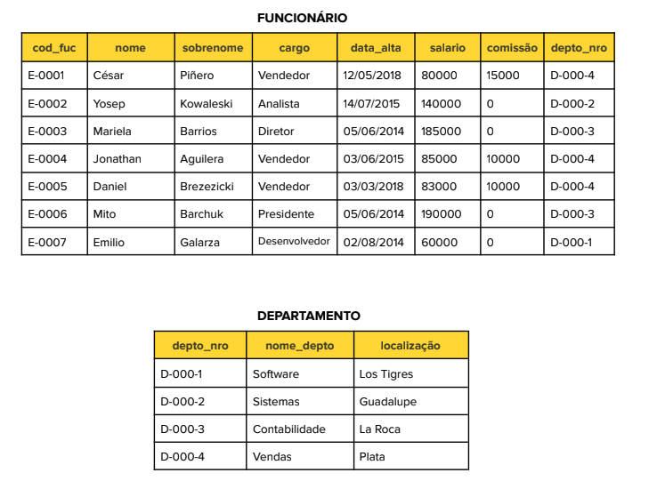

# Banco de Dados Relacionais
## Consultas SQL Avançadas

----------
### Tendo as tabelas de um banco de dados da empresa:


### É necessário obter as seguintes consultas:

1. Selecione o nome, cargo e localização dos departamentos onde os vendedores trabalham.

```
SELECT d.nome_depto, f.cargo, d.localizacao FROM departamento as d INNER JOIN funcionario as f ON d.depto_nro = d.depto_nro
```

2. Visualize departamentos com mais de cinco funcionários.

```
SELECT d.* FROM departamento as d INNER JOIN funcionario as f ON d.depto_nro = d.depto_nro GROUP BY d.depto_nro HAVING COUNT(*) > 5;
```

3. Exiba o nome, salário e nome do departamento dos funcionários que têm o mesmo cargo que 'Mito Barchuk'.

```
SELECT f.nome, f.salario, d.nome_depto FROM funcionario as f INNER JOIN departamento as d ON d.depto_nro = d.depto_nro WHERE f.cargo = (SELECT cargo FROM funcionario WHERE nome = 'Mito' AND sobrenome = 'Barchuk');
```

4. Mostre os dados dos funcionários que trabalham no departamento de contabilidade, ordenados por nome.

```
SELECT f.* FROM funcionario as f INNER JOIN departamento as d ON d.depto_nro = d.depto_nro WHERE d.nome = 'Contabilidade' ORDER BY f.nome ASC;
```

5. Mostre o nome do funcionário que tem o menor salário.

```
SELECT nome FROM funcionario WHERE salario = (select min(salario) from funcionario);
```

6. Mostre os dados do funcionário que tem o maior salário no departamento 'Vendas'.

```
SELECT f.* FROM funcionario as f INNER JOIN departamento as d ON d.depto_nro = f.depto_nro WHERE d.nome_depto = 'Vendas' ORDER BY salario DESC LIMIT 1;
```